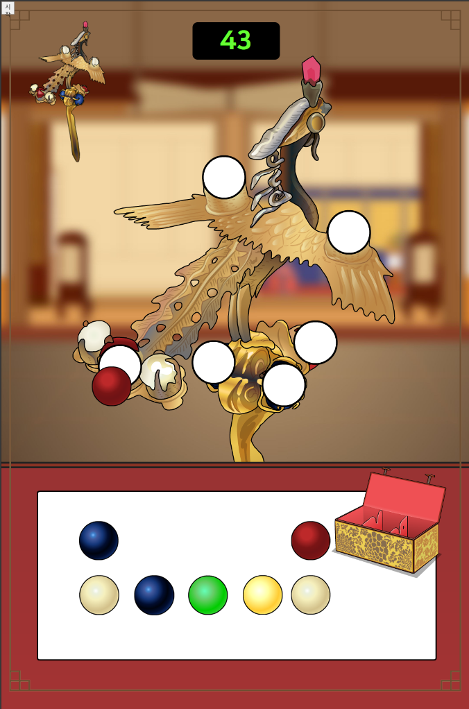
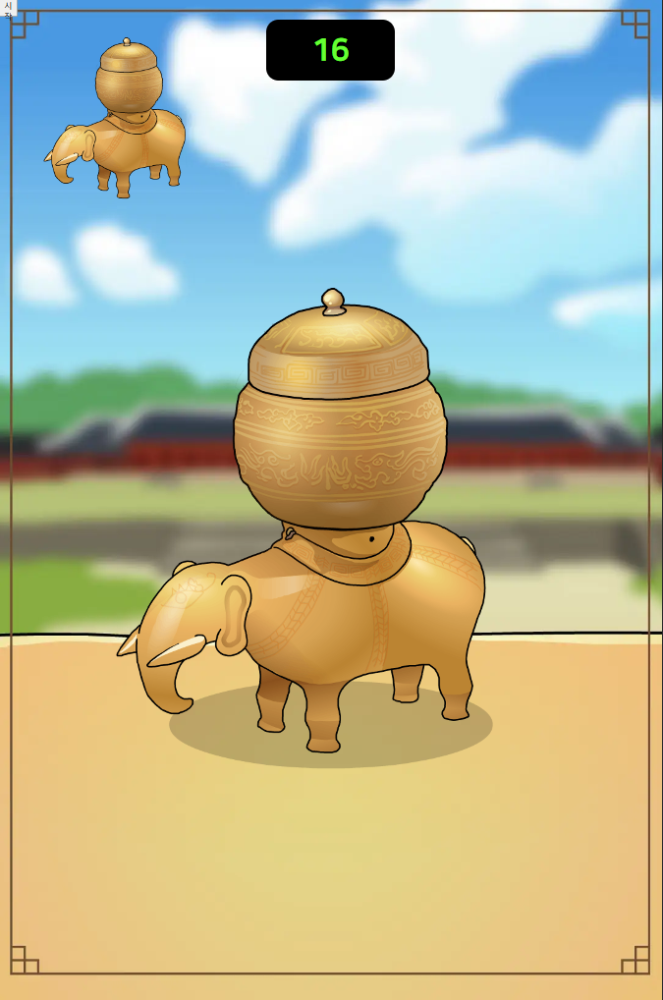
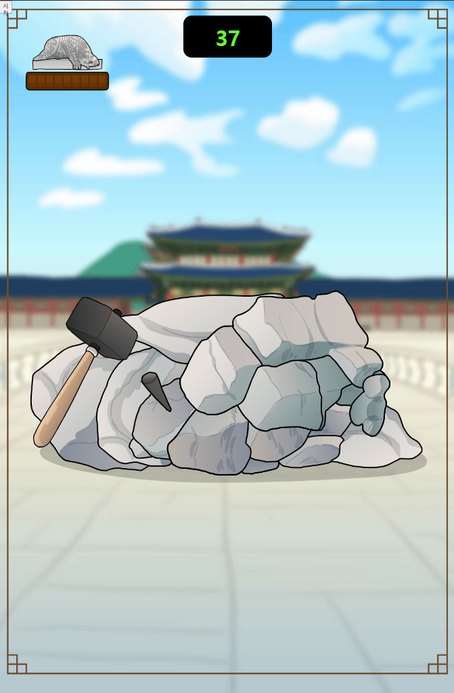
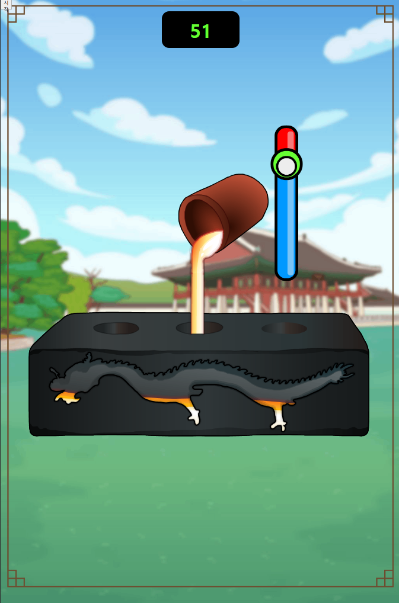
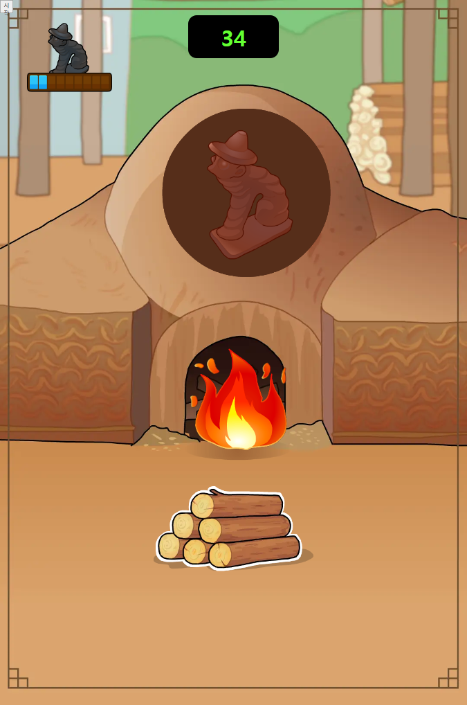

# 🏛️ 고궁 박물관 프로젝트
### 문화유산과 함께하는 인터랙티브 게임

 

---

## 📅 프로젝트 개요

> **기간** : 2024.09.01 ~ 2024.11.10  
> **인원** : 1명  
> **목적** : 고궁 박물관의 문화유산을 게임으로 소개하는 인터랙티브 콘텐츠 제작

 

## 🎮 게임 콘텐츠

### 1️⃣ 보석 맞추기
- 💎 유물에서 빠진 보석을 찾아 맞추는 게임
- 직관적인 드래그 앤 드롭 인터페이스

### 2️⃣ 유물 선택하기
- 🔄 순차적으로 나타나는 유물 중 정답 선택
- 타이밍 기반의 퀴즈 형식

### 3️⃣ 유물 제작 체험
세 가지 제작 방식을 체험할 수 있는 미니게임
- 🪨 **돌 조각** : 터치로 조각하기
- ⚔️ **주조하기** : 쇳물로 제작하기
- 🔥 **소성하기** : 가마에서 구워내기

 

## 🛠 기술 스택

### Frontend
- ES6
- GSAP.js
- Interact.js

### 배포
- Clobot 로봇 연동

 

## ⚙️ 주요 기능

- 🤖 Clobot 로봇 감정 표현 연동
  - 게임 시작/종료
  - 성공/실패 피드백
- 👆 터치 기반 인터랙션
- ⏱️ 자동 게임 종료 (30초 미조작)

 

## 📱 최적화 정보

- **해상도** : 1080 x 1638
- **플랫폼** : 모바일 최적화
- **이벤트** : 터치 이벤트 기반

 

## 🎮 게임 실행 방법

### 1번게임 (oneGame) 브랜치
1. `git clone -b oneGame https://github.com/username/repo.git`
2. `index.html` 파일을 브라우저에서 실행

### 2번게임 (twoGame) 브랜치
1. `git clone -b twoGame https://github.com/username/repo.git` 
2. `index.html` 파일을 브라우저에서 실행

### 3번게임 (threeGame) 브랜치
1. `git clone -b threeGame https://github.com/username/repo.git`
2. `index.html` 파일을 브라우저에서 실행

 

## 🎯 게임 미리보기

| 게임 1 | 게임 2 | 게임 3 메뉴 |
|:---:|:---:|:---:|
||||

| 게임 3-1 | 게임 3-2 | 게임 3-3 |
|:---:|:---:|:---:|
||||

